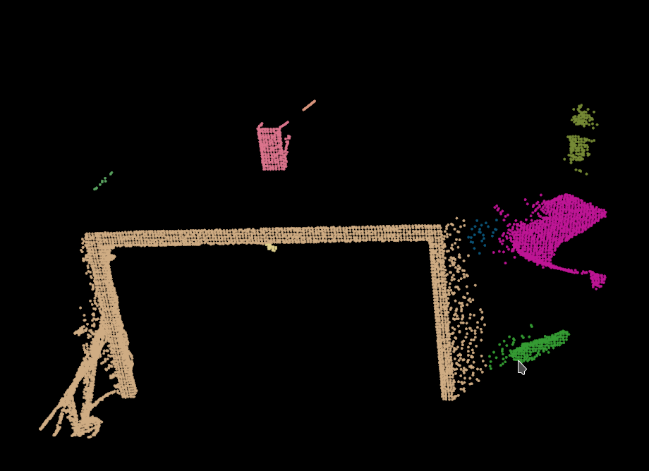

Pcl-Optics
===============

[![][license-image]][license]
![][platform-image]

[license-image]: https://img.shields.io/badge/license-MIT-green.svg?style=flat-square
[license]: https://github.com/Nandite/PclWalkerViewer/blob/master/LICENSE

[platform-image]: https://img.shields.io/badge/platorms-linux64%20%7C%20osx%20%7C%20windows-lightgrey?style=flat-square

OPTICS is an algorithm for finding density-based clusters in spatial data. It was presented by Mihael Ankerst, 
Markus M. Breunig, Hans-Peter Kriegel and Jörg Sander in 1999.

The goal of this repository is to provide a C++ implementation of the algorithm compatible with the 
cloud and points of the Point Cloud Library ([PCL](http://www.pointclouds.org/)) project, without any further 
dependencies than those required by the PCL. The metric used by the algorithm to estimate density is the euclidean
distance in a 3D space. This work is derived from the implementation made by 
[Ingo Proff](https://github.com/CrikeeIP/OPTICS-Clustering).

## Usage

```cpp
#include "Optics.hpp"

pcl::PointCloud<pcl::PointXYZ>::Ptr cloud(new pcl::PointCloud<pcl::PointXYZ>);

// 
// Adding data to the cloud of points ...
//

std::vector<pcl::PointIndicesPtr> clusters;
Optics::optics<pcl::PointXYZ>(cloud, neighborhoodMinPts, reachabilityThreshold, clusters);

for (const auto& cluster : clusters) {
    if (cluster->indices.size() < minPtsPerCluster) continue;
    
    // Do something with the cluster
}
```

You can compile and execute the example program provided:

```sh
mkdir build && cd build
cmake -DCMAKE_BUILD_TYPE=Release ..
make
./Pcl_Optics ../table_scene_lms400.pcd
```

You should get the following output into the pcl visualizer:



Each color represents a different density cluster. 

## Dependencies

The only dependencies required is the [Point Cloud Libary](http://www.pointclouds.org/).
Tests have been performed with [pcl-1.8.1](https://github.com/PointCloudLibrary/pcl/releases/tag/pcl-1.8.1),
[pcl-1.9.0](https://github.com/PointCloudLibrary/pcl/releases/tag/pcl-1.9.0) 
and [pcl-1.9.1](https://github.com/PointCloudLibrary/pcl/releases/tag/pcl-1.9.1) and using C++11, C++14 and C++17.


## Installation

The implementation resides in a single header file making it easy to integrate into a c++ project.
Just clone the repository
```sh
git clone https://github.com/Nandite/Pcl-Optics
```
Then copy the [Optics](include/Optics.hpp) header file located into the include directory in your project.

## Documentation

You will find into the [resources](resources) directory a publication from [Mihael Ankerst, Markus M. Breunig,
Hans-Peter Kriegel and Jörg Sander](resources/OPTICS.pdf) succinctly explaining the OPTICS algorithm.

There is also an excelent paper from [Izabela Anna Wowczko](https://www.academia.edu/8142139/Density_Based_Clustering_with_DBSCAN_and_OPTICS_-_Literature_Review)
of the Institute of Technology Blanchardstown explaining the principle of the algorithm.

## Feedback

Don't hesitate if you have any suggestions for improving this project, or if you find any error. I will be glad to
hear from you. Contributions are welcomed :)

## License

Distributed under the MIT Software License (X11 license).
See accompanying file LICENSE.
